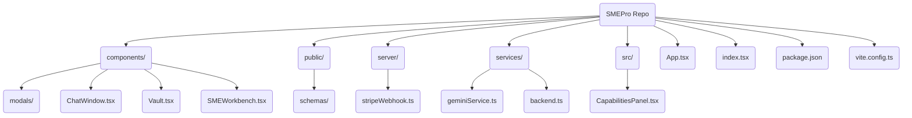

<<<<<<< HEAD
# smepro.app-prod-react-r1
frontend (React + Vite) and backend (Python/Flask) structures aligned with your Cloud Run deployment and CI/CD pipelines.
=======
# 📘 SMEPro Frontend
A modern React + Vite single-page application (SPA) for SMEPro Intelligence AI, powered by the Google Gemini API. This frontend provides the Vault, Chat, Dashboard, and AI Safety interfaces for smepro.app, connecting to a backend deployed on Google Cloud Run.

## ✨ Features
- **SME ChatWindow**: Engage in contextual, collaborative SME sessions powered by Gemini. Add multiple experts to a single conversation.
- **SMEVault & Analyzer**: Save, search, and analyze curated knowledge items. Synthesize multiple items to generate new strategies and project briefs.
- **SMEBuilder & Toolchain**: Convert analysis into tangible assets like READMEs, technical docs, and social media posts using a contextual toolchain.
- **SMEWorkbench**: A powerful workspace with advanced AI tools for generating and editing text, images, and video from various inputs.
- **Workshop Mode**: A structured, collaborative environment where a team of AI experts can co-create and refine outputs based on a defined objective and agenda.
- **Interactive Action Mode**: Turns AI responses into interactive elements for deeper insights, step-by-step execution, and dynamic, context-aware tool suggestions.
- **SAFE AI**: An interactive page demonstrating SMEPro's commitment to safety and responsible AI.
- **SMEPro Review**: A competitive analysis tool to compare SMEPro against other top AI platforms.
- **Full-Featured UI**: Includes a dashboard, session history, profile management, and light/dark modes.

## 🚀 Tech Stack
- **React 18 + Vite 5**: For fast development and efficient build tooling.
- **TypeScript**: Ensures type safety and enhances code maintainability.
- **TailwindCSS**: A utility-first CSS framework for rapid UI development.
- **Google GenAI SDK (@google/genai)**: Powers all AI analysis, chat, and generation capabilities.
- **Stripe Elements (@stripe/react-stripe-js)**: For secure, embedded, production-ready payment processing.
- **Marked + Highlight.js**: Renders rich markdown content from AI responses.

## 📂 Project Structure
This diagram shows the high-level organization of the frontend application.



## 🔑 Key Architectural Protocols

### Backend-Driven Payment Flow
The application simulates a production-ready, secure payment flow. Instead of using client-side buy buttons, it follows these steps:
1.  The user provides their details in the `SignupModal`.
2.  The frontend calls the (mock) backend service `services/backend.ts` to create a `PaymentIntent`.
3.  The mock backend simulates creating a Stripe Customer, an Ephemeral Key, and a Payment Intent, returning a `clientSecret` to the frontend. This mirrors the logic of a real Node.js/Python backend.
4.  The frontend uses this `clientSecret` to securely render the Stripe `PaymentElement`, ensuring no sensitive payment operations occur on the client.

### Webhook Verification
For a real deployment, a backend webhook handler (like the placeholder `server/stripeWebhook.ts`) is **essential**. It listens for events like `payment_intent.succeeded` directly from Stripe. This is the **source of truth** for confirming a payment, creating the user's subscription in the database, and provisioning their account. The frontend should never be trusted as the sole confirmation of a successful payment.

## ⚙️ Getting Started

### Prerequisites
- Node.js (v18 or later recommended)
- npm or yarn

### Installation
1.  **Clone the repository.**
2.  **Install dependencies:**
    ```bash
    npm install
    ```

### Running Locally
1.  The application is configured to use an API key from the environment. In a local Vite environment or a deployed environment, `process.env.API_KEY` will be available.
2.  **Start the development server:**
    ```bash
    npm run dev
    ```
The application will be available at `http://localhost:5173`.

## 🌐 Deployment
This project is configured for deployment to a container-based service like **Google Cloud Run**. The `vite.config.ts` includes a proxy for API calls, which would need to be adjusted for your specific backend URL. The `requirements.txt` and `server/` files provide scaffolding for a corresponding Python/Flask backend.
>>>>>>> 337688c (Initial commit of smepro.app---prod-release-1)
