# SMEPro Repository Structure

This document outlines the complete repository structure for the SMEPro application using a Mermaid diagram. It includes all source code, public assets, services, and type definitions for the frontend application, as well as placeholders for backend services. It also details the database schema and key integrations.

## Repository Diagram

```mermaid
graph TD
    subgraph Legend
        direction LR
        folder[fa:fa-folder Folder]
        file[fa:fa-file File]
    end

    A(SMEPro Repo)

    A --> F_components(components/)
    F_components --> F_admin(admin/)
    F_admin --> Fl_AdminDashboard(AdminDashboard.tsx)
    F_admin --> Fl_AdminLogin(AdminLoginPage.tsx)
    
    F_components --> F_modals(modals/)
    F_modals --> Fl_AnalysisResultModal(AnalysisResultModal.tsx)
    F_modals --> Fl_CapabilityExplanationModal(CapabilityExplanationModal.tsx)
    F_modals --> Fl_ChangeSme(ChangeSmeModal.tsx)
    F_modals --> Fl_EditProfile(EditProfileModal.tsx)
    F_modals --> Fl_ManageCat(ManageCategoriesModal.tsx)
    F_modals --> Fl_Modal(Modal.tsx)
    F_modals --> Fl_PaymentModal(PaymentModal.tsx)
    F_modals --> Fl_SaveToVault(SaveToVaultModal.tsx)
    F_modals --> Fl_Share(ShareSessionModal.tsx)
    F_modals --> Fl_SignupModal(SignupModal.tsx)
    F_modals --> Fl_Workshop(WorkshopSetup.tsx)
    
    F_components --> Fl_AcceptableUsePage(AcceptableUsePage.tsx)
    F_components --> Fl_ChatWindow(ChatWindow.tsx)
    F_components --> Fl_ContactPage(ContactPage.tsx)
    F_components --> Fl_Dashboard(Dashboard.tsx)
    F_components --> Fl_Editable(EditablePlaceholder.tsx)
    F_components --> Fl_Features(FeaturesPage.tsx)
    F_components --> Fl_Footer(Footer.tsx)
    F_components --> Fl_Header(Header.tsx)
    F_components --> Fl_Help(HelpPage.tsx)
    F_components --> Fl_HighlightToolbar(HighlightToolbar.tsx)
    F_components --> Fl_Home(HomePage.tsx)
    F_components --> Fl_HowItWorks(HowItWorksPage.tsx)
    F_components --> Fl_icons(icons.tsx)
    F_components --> Fl_Message(Message.tsx)
    F_components --> Fl_Onboarding(OnboardingTour.tsx)
    F_components --> Fl_PlanComp(PlanComparisonTable.tsx)
    F_components --> Fl_Plans(PlansPage.tsx)
    F_components --> Fl_PrivacyPolicyPage(PrivacyPolicyPage.tsx)
    F_components --> Fl_ResponseMode(ResponseModeSelector.tsx)
    F_components --> Fl_SafeAi(SafeAiPage.tsx)
    F_components --> Fl_SessionExp(SessionExplorer.tsx)
    F_components --> Fl_SmeHelperDialog(SmeHelperDialog.tsx)
    F_components --> Fl_SmePanel(SmePanel.tsx)
    F_components --> Fl_SmeProRev(SmeProReviewPage.tsx)
    F_components --> Fl_SmeSel(SmeSelector.tsx)
    F_components --> Fl_SMEWorkbench(SMEWorkbench.tsx)
    F_components --> Fl_StepAction(StepActionToolbar.tsx)
    F_components --> Fl_SuggestedSmesPanel(SuggestedSmesPanel.tsx)
    F_components --> Fl_TermsOfServicePage(TermsOfServicePage.tsx)
    F_components --> Fl_TextAction(TextActionToolbar.tsx)
    F_components --> Fl_ThemeSwitcher(ThemeSwitcher.tsx)
    F_components --> Fl_UsageMeter(UsageMeter.tsx)
    F_components --> Fl_UsageView(UsageView.tsx)
    F_components --> Fl_UserIdentity(UserIdentity.tsx)
    F_components --> Fl_Vault(Vault.tsx)

    A --> F_public(public/)
    F_public --> F_schemas(schemas/)
    F_schemas --> Fl_biz_cat(business_categories.json)
    F_schemas --> Fl_solo_cat(solo_categories.json)
    F_schemas --> Fl_vault_cat(vault_categories.json)
    
    A --> F_server(server/)
    F_server --> Fl_server_backend(backend.ts)
    F_server --> Fl_server_stripe(stripeWebhook.ts)

    A --> F_services(services/)
    F_services --> Fl_backend_svc(backend.ts)
    F_services --> Fl_collab(collaborationService.ts)
    F_services --> Fl_configSvc(configService.ts)
    F_services --> Fl_gemini(geminiService.ts)

    A --> F_src(src/)
    F_src --> F_src_comp(components/)
    F_src_comp --> Fl_Capabilities(CapabilitiesPanel.tsx)
    F_src --> Fl_src_types(types.ts)

    A --> Fl_App(App.tsx)
    A --> Fl_backend_root(backend.ts)
    A --> Fl_constants(constants.ts)
    A --> Fl_index_html(index.html)
    A --> Fl_index_tsx(index.tsx)
    A --> Fl_metadata(metadata.json)
    A --> Fl_package(package.json)
    A --> Fl_README(README.md)
    A --> Fl_repo(repo_structure.md)
    A --> Fl_requirements(requirements.txt)
    A --> Fl_tsconfig(tsconfig.json)
    A --> Fl_tsconfig_node(tsconfig.node.json)
    A --> Fl_types(types.ts)
    A --> Fl_vite(vite.config.ts)
```

## Database Schema (PostgreSQL)

The following schema represents the expected database structure for the backend.

-   **users**
    -   `id` (uuid, primary key)
    -   `name` (varchar)
    -   `email` (varchar, unique)
    -   `company` (varchar, nullable)
    -   `stripe_customer_id` (varchar, unique)
    -   `created_at` (timestamp with time zone)

-   **subscriptions**
    -   `id` (uuid, primary key)
    -   `user_id` (uuid, foreign key to `users.id`)
    -   `stripe_subscription_id` (varchar, unique)
    -   `plan_type` (varchar: 'solo', 'business')
    -   `level_up_package` (varchar, nullable: 'solo-plus', 'business-adv', 'enterprise-oem')
    -   `status` (varchar: 'trialing', 'active', 'canceled')
    -   `billing_cycle` (varchar: 'monthly', 'annual')
    -   `trial_start` (timestamp, nullable)
    -   `trial_end` (timestamp, nullable)
    -   `created_at` (timestamp with time zone)

-   **vault_items**
    -   `id` (uuid, primary key)
    -   `user_id` (uuid, foreign key to `users.id`)
    -   `title` (varchar)
    -   `content` (text)
    -   `category` (varchar)
    -   `tags` (jsonb)
    -   `builder_ready` (boolean, default: false)
    -   `created_at` (timestamp with time zone)

## Integrations & Mappings

### Google Gemini API
-   **Service File**: `services/geminiService.ts`
-   **Function**: This service is the sole interface to the Google Gemini API. It abstracts all AI-related calls.
-   **Models Used**:
    -   `gemini-flash-lite-latest`: For low-latency tasks like chat, suggestions, and UI guidance.
    -   `gemini-2.5-pro`: For complex, high-reasoning tasks like Vault analysis and code generation.
    -   `imagen-4.0-generate-001`: For high-quality image generation in the SME Workbench.
    -   `gemini-2.5-flash-image`: For fast image editing tasks.
    -   `veo-3.1-fast-generate-preview`: For video generation (image animation).
-   **Authentication**: Uses `process.env.API_KEY` provided by the Vite build environment.

### Stripe Payments
-   **Service File**: `services/backend.ts` (mock), `server/stripeWebhook.ts` (scaffold)
-   **Function**: Manages the subscription lifecycle.
-   **Frontend Flow (`SignupModal.tsx`)**:
    1.  Uses `@stripe/react-stripe-js` and `@stripe/stripe-js` to create an `Elements` context.
    2.  Calls the mock backend to get a `clientSecret` for a Payment Intent.
    3.  Renders the `<PaymentElement>` to securely collect payment details.
    4.  Simulates `stripe.confirmPayment()`.
-   **Backend Flow (Production)**:
    1.  An endpoint (e.g., `/create-payment-intent`) creates a Stripe Customer, an Ephemeral Key, and a Payment Intent.
    2.  A webhook handler (`/webhook`) securely listens for events from Stripe (e.g., `payment_intent.succeeded`) to update the user's subscription status in the database. This is the source of truth for payments.
